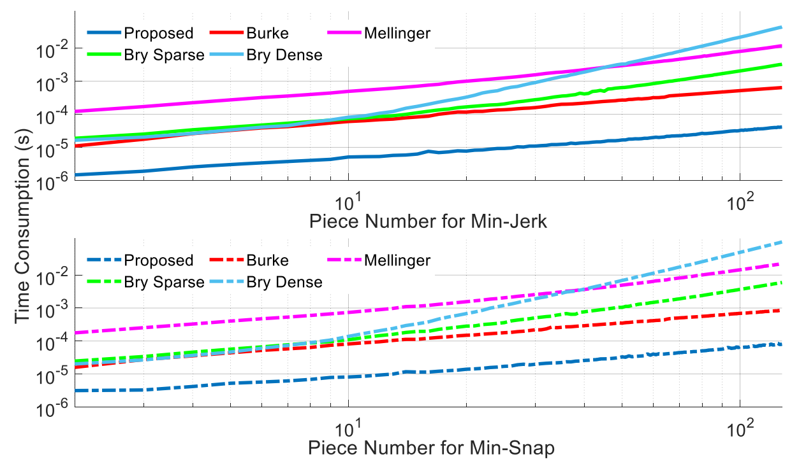
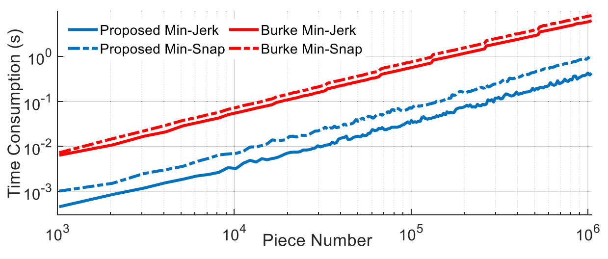

# Large-Scale Trajectory Optimizer
This is __probably the fastest__ minimum jerk or minimum snap trajectory generator you can find.

It also provides __analytical gradient__ of energy with respect to time allocations and waypoints.

## 1. About
This is a highly-algorithmically-optimized implementation for minimum jerk/snap trajectories with exact gradient w.r.t. time allocation and waypoints. All involved computations enjoy [__linear time and space complexity__](https://en.wikipedia.org/wiki/Time_complexity). It is based on completely analytical results of our paper. Only [__two header files__](https://github.com/ZJU-FAST-Lab/large_scale_traj_optimizer/tree/main/include) are all you need to use our module as __a super efficient differentiable black box__.

ICRA Paper: [__Generating Large-Scale Trajectories Efficiently using Double Descriptions of Polynomials__](https://ieeexplore.ieee.org/document/9561585)

([Video](https://www.youtube.com/watch?v=tA3fIyggH4I) and [Arxiv](https://arxiv.org/pdf/2011.02662v3.pdf) are avaiable.)

If this repo helps you, please cite our paper:

    @inproceedings{wang2021glst,
        title={Generating Large-Scale Trajectories Efficiently using Double Descriptions of Polynomials},
        author={Wang, Zhepei and Ye, Hongkai and Xu, Chao and Gao, Fei},
        address={Xi'an, China},
        booktitle={IEEE International Conference on Robotics and Automation},
        pages={7436-7442},
        year={2021},
        organization={IEEE}
    }

__Author__: [Zhepei Wang](https://zhepeiwang.github.io/) and [Fei Gao](https://ustfei.com/) from the [ZJU Fast Lab](http://zju-fast.com/).

## 2. How to Use

__a__. Initialize an instance of "__JerkOpt/SnapOpt__"

__b__. Call "__reset__" to specify the piece number and initial/terminal conditions. The i-th column of "headState/tailState" is a 3-dimensional specified (i-1)-order derivative. For example, the initial/final position is always stored in the first column.

__c__. Call "__generate__" to compute a minimum jerk/snap trajectory that passes intermediate waypoints with specified time allocations. The i-th column of "__inPs__" is a 3-dimensional vector of the i-th intermediate waypoint. For example, there are 4 columns of waypoints and 5 time durations for a 5-piece trajectory.

__d__. Call "__getObjective__" to get energy cost.

__e__. Call "__getGradT__" and "__getGradInnerP__" to obtain gradients for the specified time allocation and intermediate waypoints.

__f__. If needed, repeat __c__, __d__, and __e__ to optimize time allocation and intermediate waypoints using the objective and the gradient.

__g__. Call "__getTraj__" to obtain the trajectory.

Note: Part __c__ must be conducted after __a__ and __b__. Part __d__, __e__, __f__ and __g__ must be conducted after __c__.

## 3. Examples

__Example 1__ gives the computation speed of our implementation. Please use __catkin_make__ of ROS to build the source code of this example.

__Example 2__ is only described in the the related paper as a high-performance large-scale trajectory optimizer. By following the paper, you can use our differentiable black box to directly optimize both the waypoints and times of a trajectory. It can achieve almost the same trajectory quality as the global trajectory optimizer in [Teach-Repeat-Replan](https://github.com/HKUST-Aerial-Robotics/Teach-Repeat-Replan) while using significantly less computation time.

## 4. Performance

We compare our original implementation with four existing works. The original performance is shown as follows. The performance of the up-to-date master branch is __SIGNIFICANTLY HIGHER__ than that is shown in the figure.

  

  

 <em> Burke et al., “Generating minimum-snap quadrotor trajectories really fast,” IROS 2020. </em>   
 <em> Bry et al., “Aggressive flight of fixed-wing and quadrotor aircraft in dense indoor environments,” IJRR 2015. </em>   
 <em> Mellinger et al., “Minimum snap trajectory generation and control for quadrotors,” ICRA 2011. </em> 
